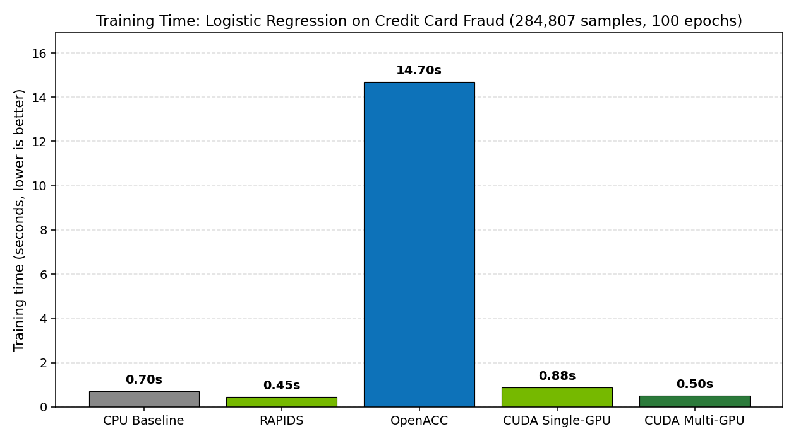
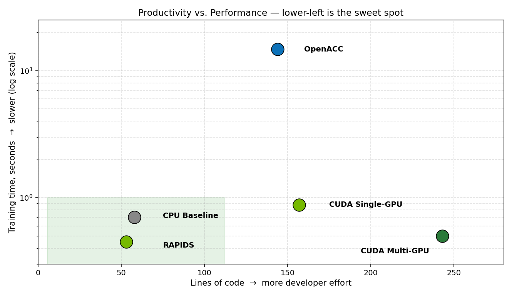

# GPU Logistic Regression Benchmark

**Three GPU programming paradigms, one machine learning workload, head-to-head.**


This project trains the same logistic regression classifier on the same dataset using four implementations and a CPU baseline, then measures what each one actually costs you — in wall-clock time, in accuracy, and in lines of code you have to write to get there.

| Phase | Paradigm | Implementation |
| :--- | :--- | :--- |
| Baseline | Single-threaded CPU | NumPy (`cpu_baseline.py`) |
| 1 | High-level GPU library | RAPIDS — cuDF + cuML (`rapids_model.py`) |
| 2 | Compiler directives | OpenACC — `#pragma acc` (`openacc_model.cpp`) |
| 3 | Hand-written GPU kernel | CUDA C/C++ (`cuda_model.cu`) |
| 3+ | Multi-GPU data parallel | CUDA across 2 GPUs (`cuda_model_multigpu.cu`) |

Originally my ECE 403 / DSCI 421 final project at Lehigh University, Spring 2026. The full written report is in [`docs/report.pdf`](docs/report.pdf); a transcript of a real run of each implementation is in [`docs/sample_output.txt`](docs/sample_output.txt).

---

## Results



| Implementation       | Training time | Accuracy | Speedup vs CPU | Lines of code |
| -------------------- | ------------: | -------: | -------------: | ------------: |
| CPU baseline (NumPy) |        0.70 s |   0.9946 |          1.00× |             58 |
| RAPIDS (cuML)        |    **0.45 s** | **0.9989** |        1.56× |         **53** |
| OpenACC              |       14.70 s |   0.9946 |          0.05× |            144 |
| CUDA single-GPU      |        0.88 s |   0.9946 |          0.80× |            157 |
| **CUDA multi-GPU**   |    **0.50 s** |   0.9946 |        **1.40×** |          243 |

> *Hardware:* 2× NVIDIA RTX 2080 Ti (Turing, sm_75) with NVLink, on the Lehigh ECE `hpc04` workstation. LOC counts non-blank, non-comment lines and includes the 64-line shared `csv_loader.hpp` for the C++/CUDA implementations.

### Productivity vs. performance

The headline numbers don't tell the whole story — the *interesting* question is "what does each implementation cost?" The chart below maps each implementation in a two-dimensional space: developer effort on the x-axis, runtime on the y-axis (log scale). The green region is the sweet spot.



### How to read these numbers

- **RAPIDS lands in the sweet spot — but it's not playing the same game.** cuML's `LogisticRegression` uses an L-BFGS quasi-Newton solver internally, while every other implementation here uses vanilla full-batch gradient descent. RAPIDS converges in fewer effective iterations because of the solver, not because of the GPU. The accuracy difference (0.9989 vs 0.9946) is the tell: it fit a slightly better-converged model. That's a real win, but it's a win you get from the *library*, not from *parallelism*.

- **OpenACC is the surprise.** It compiled, ran, produced the correct answer — and was ~17× slower than the hand-written CUDA kernel. Profiling (see [`profiles/`](profiles/)) shows the loss to per-epoch host-device synchronization that `#pragma acc data` introduces around the gradient reduction. Productivity isn't free, and on this workload it's expensive.

- **The hand-written CUDA kernel is the honest baseline.** Same math as the CPU and OpenACC implementations, no library doing work behind the scenes. It runs about as fast as optimized CPU NumPy — which is fair: 285k samples × 29 features fits in CPU L2, and NumPy ships SIMD-optimized BLAS. The GPU's bandwidth advantage doesn't get to flex on a workload this small.

- **Multi-GPU gives 1.77× over single-GPU**, not 2×. The kernel itself scales nearly perfectly across two devices, but every epoch has a fixed host-side aggregation step (pull two partial gradients to host, sum, push weights back). At 100 epochs that overhead adds up. NCCL `all-reduce` would close most of the gap.

---

## Repository layout

```
credit-card-logreg-gpu-bench/
├── src/
│   ├── csv_loader.hpp           shared CSV parser, used by all 3 C++/CUDA targets
│   ├── cpu_baseline.py          reference implementation (NumPy, single thread)
│   ├── rapids_model.py          Phase 1: cuDF + cuML
│   ├── openacc_model.cpp        Phase 2: #pragma acc directives
│   ├── cuda_model.cu            Phase 3: hand-written CUDA kernel
│   └── cuda_model_multigpu.cu   Phase 3 extension: data-parallel across 2 GPUs
├── scripts/
│   └── make_chart.py            regenerates the README charts
├── profiles/                    Nsight Systems profiles (.nsys-rep) for all 4 phases
├── docs/
│   ├── report.pdf               full written project report
│   └── sample_output.txt        transcript of one run of each implementation
├── assets/                      chart images used by the README
├── Makefile                     `make` builds all GPU binaries
├── requirements.txt             CPU baseline dependencies
└── LICENSE                      MIT
```

---

## Quick start

### 1. Get the dataset (~150 MB)

The Credit Card Fraud Detection dataset (284,807 transactions, 29 features after dropping `Time`, binary fraud label) is not checked in. Download `creditcard.csv` from Kaggle and place it in the repository root:

> https://www.kaggle.com/datasets/mlg-ulb/creditcardfraud

### 2. Build the GPU binaries

```bash
make                    # builds openacc_model, cuda_model, cuda_model_multigpu
```

For newer GPUs:

```bash
make CUDA_ARCH=sm_86    # Ampere (RTX 30xx, A100)
make CUDA_ARCH=sm_89    # Ada (RTX 40xx)
make CUDA_ARCH=sm_90    # Hopper (H100)
```

### 3. Run

```bash
# CPU reference
pip install -r requirements.txt
python3 src/cpu_baseline.py

# Phase 1: RAPIDS — see "Installing RAPIDS" below for env setup
conda activate rapids_env
python3 src/rapids_model.py

# Phase 2: OpenACC
./openacc_model

# Phase 3: CUDA single-GPU
./cuda_model

# Phase 3 extension: CUDA multi-GPU (requires ≥ 2 CUDA devices)
./cuda_model_multigpu
```

A successful run looks like [`docs/sample_output.txt`](docs/sample_output.txt). Every implementation prints a `Positive label rate: 0.00172749 (492 / 284807)` sanity-check line — if yours doesn't, the CSV parser is misreading the file and the accuracy number that follows is meaningless.

### 4. Profile with Nsight Systems (optional)

Pre-generated profiles for all four GPU phases are in [`profiles/`](profiles/) — open them in the Nsight Systems GUI. To regenerate:

```bash
nsys profile --stats=true -o profiles/nsys_phase3_cuda ./cuda_model
```

---

## Installing RAPIDS

RAPIDS is the trickiest dependency because it must be installed via conda (no pip install), and the install command depends on your CUDA version. From the [RAPIDS release selector](https://docs.rapids.ai/install/):

```bash
conda create -n rapids_env -c rapidsai -c conda-forge -c nvidia \
    cudf=25.04 cuml=25.04 python=3.10 cuda-version=12.5
conda activate rapids_env
```

---

## Requirements

| Component | Used for |
| :--- | :--- |
| NVIDIA GPU, compute capability ≥ sm_75 | All GPU phases |
| 2 NVIDIA GPUs (NVLink optional) | Multi-GPU phase only |
| CUDA Toolkit 12.x | `nvcc` for the CUDA targets |
| NVIDIA HPC SDK 25.1+ | `nvc++` for the OpenACC target |
| RAPIDS 25.x (conda) | `cudf`, `cuml` for Phase 1 |
| Python 3.10+ | CPU baseline and chart regeneration |
| NVIDIA Nsight Systems | Opening the `.nsys-rep` profiles |

---

## Reproducibility

All four full-batch implementations (CPU, OpenACC, CUDA single, CUDA multi) share identical hyperparameters and converge to **0.9946** accuracy:

- 100 epochs
- Learning rate 0.01
- No regularization
- No bias / intercept term (weights initialized to zero)
- 29 features (the non-predictive `Time` column is dropped)
- Trained AND evaluated on the full 284,807-sample dataset

**Documented divergences** (called out so they aren't surprises):

1. *RAPIDS uses L-BFGS, not gradient descent.* cuML chooses its own solver and there's no public knob to force it to GD. The 0.9989 accuracy reflects a slightly more-converged model fit by the better optimizer. This is deliberate — measuring this is part of why Phase 1 exists.
2. *The CSV parser strips surrounding double-quotes from cells.* The dataset wraps the `Class` column in quotes (`"0"`, `"1"`), which would otherwise cause `std::stoi` to throw and silently leave `y[]` zero-initialized. With a zero label vector you'd get ~99.83% accuracy (the majority-class rate) and your benchmark would look correct. The `print_label_stats` helper in `csv_loader.hpp` is there to catch exactly this failure mode.

---

## What I'd do next

- Replace the kernel's `atomicAdd` with a block-level shared-memory reduction. ~285k threads contending on 29 atomic slots is the kernel's main bottleneck, and Nsight confirms it.
- Replace the host-mediated gradient aggregation in the multi-GPU path with NCCL `all-reduce` for direct device-to-device sums over NVLink.
- Sweep batch size — full-batch GD is a worst case for GPU utilization on a model this small. Mini-batch should change the OpenACC story noticeably.
- Add PyTorch / JAX as additional "high-level library" baselines alongside RAPIDS, so RAPIDS isn't the lone data point at the productivity end.

---

## License

MIT — see [`LICENSE`](LICENSE).

## Author

**Netaji Meka** · Electrical & Computer Engineering, Lehigh University · [nsm325@lehigh.edu](mailto:nsm325@lehigh.edu)
